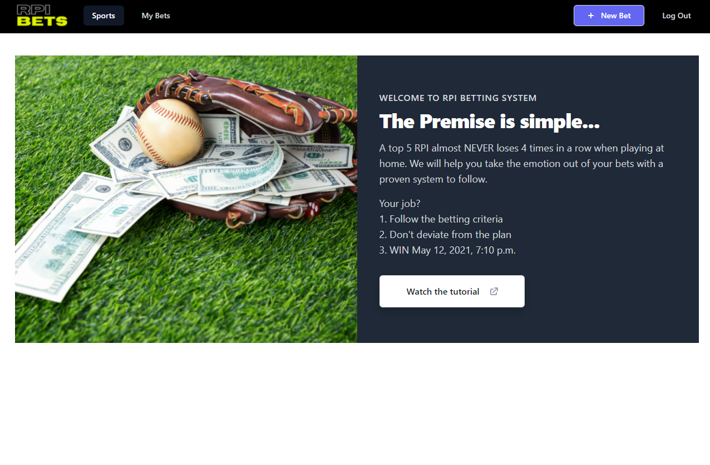
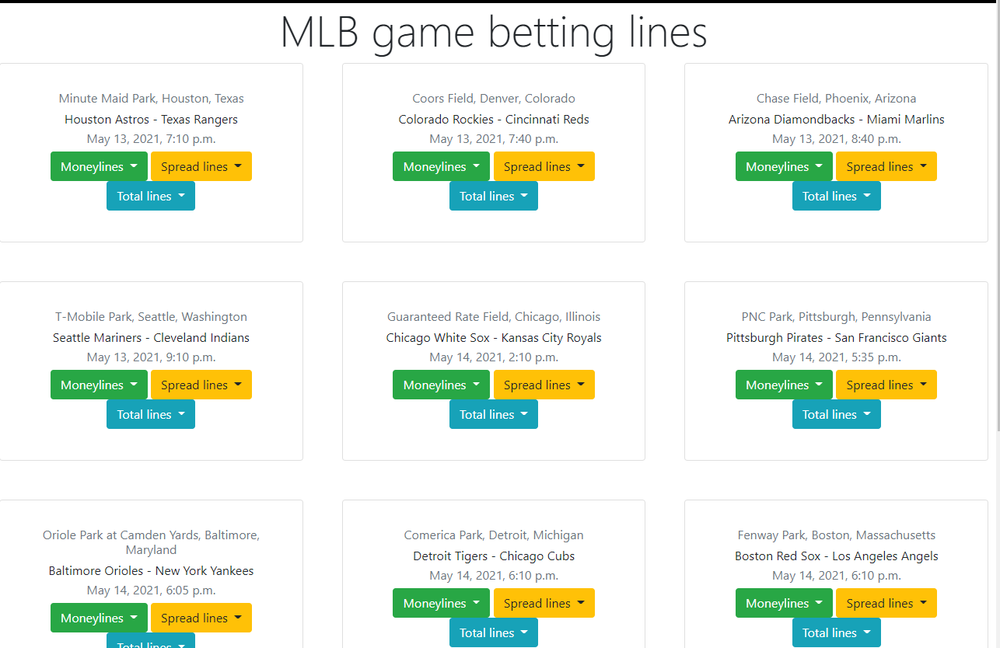
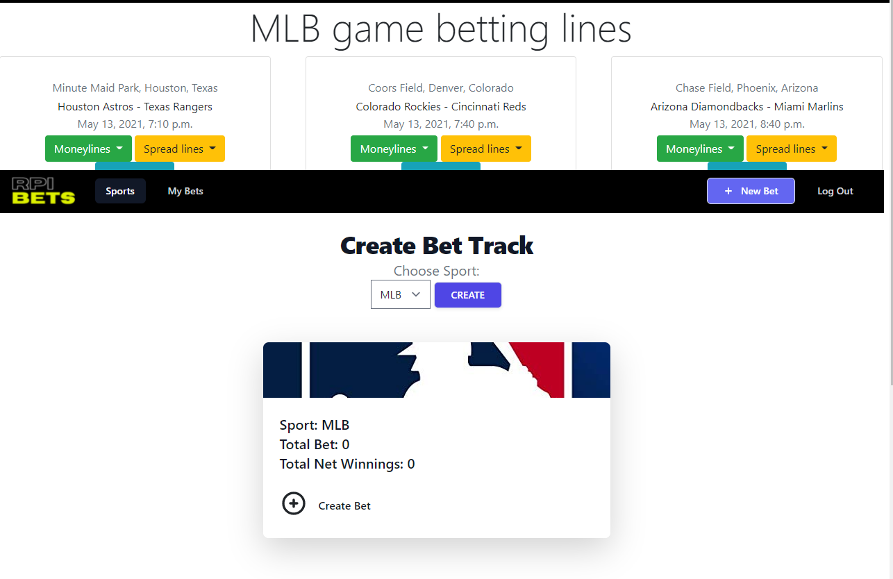

# Introduction

The sports betting community is huge. One of the biggest problems with sports betting however is letting your emotions get the best of you and thats when you lose big. 

To fill this gap, I have created RPI Bets. RPI Bets is a platform which is easy for a casual or experience bettor to track their bets and follow the system logic to remove the emotion from betting. 

# Table of Contents
- [Introduction](#introduction)
- [Table of Contents](#table-of-contents)
- [Instructions for Use](#instructions-for-use)
- [Tech Framework](#tech-framework)
    - [This app uses:](#this-app-uses)
    - [We built this app with:](#we-built-this-app-with)
    - [This app is hosted at:](#this-app-is-hosted-at)
- [Future Plans](#future-plans)
- [Special Thanks](#special-thanks)
- [About the Developer](#about-the-developer)
    - [Christian Mosley](#christian-mosley)
- [Appendices](#appendices)
  - [Appendix A: Databases & Project Planning](#appendix-a-databases--project-planning)
    - [Databases](#databases)
  - [Appendix B: Product Screenshots](#appendix-b-product-screenshots)

[Back to Top](#top)

# Instructions for Use

The user first arrives at a [home page](<#appendix-a-picture-001-home-page') when navigating to the root directory of the URL and is prompted to log in or sign up for an account.  Once signed-in, the user can navigate to the [sports page](#appendix-b-picture-002-sports-page-logged-in) that shows a list of current games for the day.  

The user can create a bet track on the [bets page](#appendix-c-picture-003-bets-page-logged-in). From here the user can create a bet to start tracking their bets under their newly created bet track. 

# Tech Framework

### This app uses:
* HTML5 and CSS
* JavaScript ES6
* Python v 3.8.6
* [Django](https://www.djangoproject.com/) v 3.2.2
* [Django-Tailwind](https://tailwindcss.com/) v 2.0.1

### We built this app with:
* [VSCode](https://code.visualstudio.com/) version 1.55.2
* [PostgreSQL](https://www.postgresql.org/)
* [Google Chrome](https://www.google.com/chrome/) version 90.0.4430.85 (Official Build) (arm64)
* Zsh version with [Oh My Zsh](https://ohmyz.sh/)
* [GitHub](https://github.com/) (online, not desktop)

### This app is hosted at:
* [GitHub Repo](https://github.com/cmosley/RPIbets)
* [Heroku Hosted Site](http://rpi-bets.herokuapp.com)

[Back to Top](#top)

# Future Plans
* Rewrite the App in the MERN stack
* Add bet logic for A thru D bets
* Expand the functionality of bets under bet tracks
  * Includes grapping total of bets to display on bet track (Profile Model)
  * Auto update bet status on win/loss
* Host the site on custom URL 
  * Configure Google Analytics.
* Add a password recovery feature.
* Create a custom favicon.
* Improve CSS to make the site more eye-friendly.
* Add mobile-responsive CSS.
* Add support for OAuth
  * Google, GitHub
  * Sync data models for OAuth information with the current `User` model.  Must have two-way referencing.
* Create additional pages and views.
  * Create a tutorial page with videos.
  * A leaderboard of winnings of all users
* Allow users to upload avatar images.
  * Allow the user to filter betting information based on preferred betting site
* Eliminate edge cases in betting data display
* Create dark/light modes.

[Back to Top](#top)

# Special Thanks

* Instructors (Ben Manley, David Stinson) and peers from the General Assembly SEIR-EC-2-22 cohort for collaboration in developing this app.
* Formatting this `README.md` file was easy with the help of the [Markdown Live Preview](https://markdownlivepreview.com/) tool and GitHub Guide's [Mastering Markdown](https://guides.github.com/features/mastering-markdown/) page.
* [Whimsical](https://whimsical.com/wireframes) was used to generate the wireframe images and ERDs seen throughout this `README.md` file.

[Back to Top](#top)
<#appendix-c-picture-001-home-page id='appendices'></#appendix-c-picture-001-home-page>

# About the Developer

### Christian Mosley

Christian is a web developer from Fort Worth, TX. With a passion for business, sports and technology, Christian decided on a career change during COVID when he found the time to cultivate his passion for web development.  Learn more about Christian at these links:

* [LinkedIn](https://www.linkedin.com/in/christian-mosley)
* [GitHub](www.GitHub.com/cmosley)

# Appendices

[Back to Top](#top)

## Appendix A: Databases & Project Planning

### Databases

**Model: Profile**  |  (profile data)
* `total_bets` user's total bets
* `total_wins` user's total bet wins
* `bank_roll` user's bankroll 
* `winnings` user's bet winnings
* `user` user's profile is associated with
 
  
**Model: BetTrack**  |  (bet track data)
* `sport` which sport being tracked
* `active` active track or not
* `user` user association 
* `total_bet` total bet dollars in bet track
* `total_net` net winnings in bet track

**Model: Bet**  |  (bet data)
* `bet_type` bet type in system
* `user` user association
* `date` date of game
* `sport` which sport being tracked
* `home_team` home team
* `away_team` away team
* `betting_line` betting line chosen
* `bet_amount` amount bet on game
* `won` status of game

**Entity Relationship Diagram (ERD) & Wireframes & Mockups**
)

[Back to Top](#top)

## Appendix B: Product Screenshots 

**Deployed Home Page - | Current**

---

**Deployed Sports Page - User Logged In | Current**

---

**Deployed Bets Page - User Logged In**

